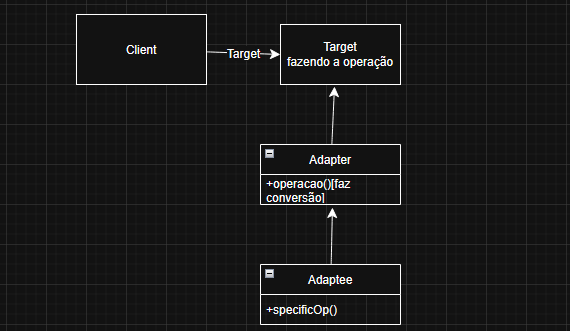
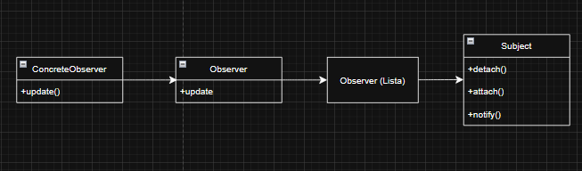
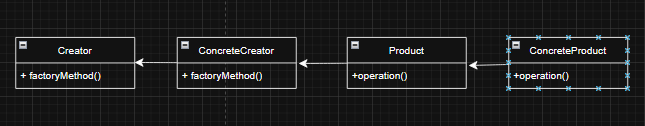
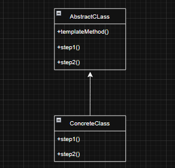

## 1.
Os dois comandos são usados para integrar alterações de uma branch.

`git Merge` : É uma opção muito segura e fácil, sendo uma operação não destrutiva. O histórico de commits fica de mais facil o seu rastreamento, único problema é se for muito usado acaba deixando o log de commits muito "sujo".

`git rebase` : Ele realoca uma branch de feature para a ponta da branch maim, nele não há a criação de commits de merges, deixando o histórico mais clean. Só existe um perigo em caso de branches compartilhados.

## 2.

O pull request(PR) funciona igual a um git merge só que democrático. Após criar uma branch de feature/fix para não atrapalhar a main ou develop, desenvolve as mudanças e envia para o repositório remoto usando o `git push origin fix/exemplo`, abra o repositório no github e cria o PR e fica no aguardo da análise dos membros da equipe de desenvolvimento. Isso também ajuda, porque o código comentam possíveis melhorias para o código.

## 3.

A computação em nuvem é uma conceito de poder usar processamento e armazenamento, que não seja da sua máquina. Por exemplo, digamos que uma empresa tenha que gastar rios de dinheiro montando uma infraestrutura para lidar com servidores, segurança, temperatura, gastos de energia e rede. Mas graças a computação em nuvem, podemos alugar um espaço em algum datacenter no mundo que tenha as configurações específicas para cada caso, isso é uma grande vantagem em não ter que se preocupar com esses fatores de infraestrutura, fora que a nuvem tem suas vantagens com sua escalabilidade(vertical e horizontal) e a elasticidade que a aplica a escalabilidade em tempo real. Outra vantagem é poder acessar em qualquer lugar desde que tenha conexão com a internet.

## 4.

O framework consegue entregar uma estrutura completa e robusta para o desenvolvimento de aplicações, definindo um fluxo de trabalho. Exemplo o Django e Spring Boot, define o toda a estrutura do projeto. Já as bibliotecas(Lib) é um conjunto de funções e classes para reutilizar quando necessário no projeto, e diferente de um framework, não muda o fluxo de trabalho da aplicação.

## 5.

`Monolítica`: Usam o mesmo repositório de forma centralizada(front + back + bd), o mesmo banco de dados já que eles estão juntos no mesmo ambiente. Sua vantagem é ser simples demais de implementar, o problema surge quando vamos escalar a aplicação.

`Microserviços`: São vários repositórios, com cada serviço separado(pagamentos, clientes, histórico e etc.), cada um do microserviço pode escalar de forma isolada. Só que a complexidade acaba crescendo bastante, por conta de exigir muita comunicação entre serviços.

## 6.

API rest, é uma arquitetura usada para construição de serviços web usando requisições HTTP, ou-seja, cliente-servidor. Uma das suas caracteristicas é usar os métodos de GET,POST, PUT, DELETE, as respostas podem ser guardadas para melhorar a performance. Como dito anteriormente, são perfeitas para aplicações web e mobile, comunicação com sistemas distribuídos e APIs abertas.

## 7.

Os padrões de projeto representam soluções reutilizáveis para questões frequentes na criação de software. São estratégias e práticas para estruturar e organizar sistemas. Servem para evitar a reinvenção da roda, utilizando coisas que ja foram feitas e testadas, código mais organizado/ "clean code".

## 8.

Uma situação de conflito de merge acontece quando o Git não consegue integrar automaticamente duas alterações realizadas em um mesmo documento, pois tais alterações são incompatíveis. Tipo uma mudanças na mesma linha feita por dois dev diferentes. Para resolver Identificar o conflito usando um git status, fazer a edição com o arquivo em conflito, marca o conflito como resolvido e da um merge.

## 9.

### Adapter:

É um padrão estrutural usado para fazer duas interfaces incompatíveis trabalharem juntas. Literalmente fazendo elas se adaptarem umas as outras, atuando como um intermédio. Bastante usado para fazer uso de uma API legado a um novo sistema.

### Observer:

O padrão comportamental Observer consiste em um objeto (Sujeito) que mantém uma lista de dependentes (Observadores) e os notifica automaticamente sempre que seu estado se altera. Usado normalmente, para eventos e notificações

## 10.

### Factory Method:

O Método do Factory é um padrão de criação que transfere a criação de objetos para subclasses, eliminando a utilização direta de new e proporcionando maior flexibilidade na geração de instâncias. Criar instâncias sem acoplar o código original

### Template Method

O Método do Template é um modelo comportamental que estabelece a estrutura básica de um algoritmo em uma superclasse, possibilitando que subclasses substituam partes específicas sem alterar a estrutura geral. Seu uso comum é para evitar repetição de código ao definir um fluxo.

